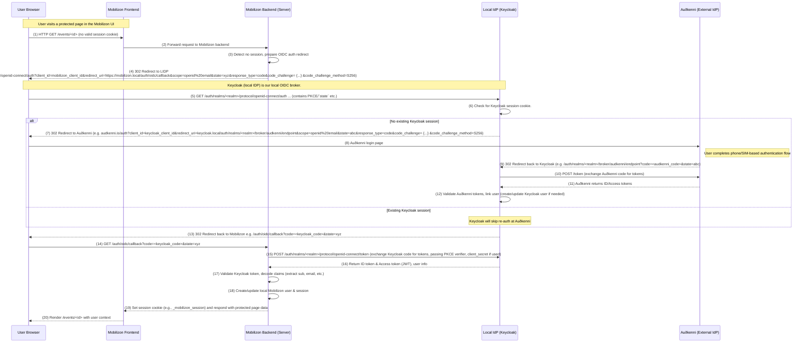

# Saman

## Auth Prototype

```mermaid
sequenceDiagram
    participant U as User Browser
    participant MF as Mobilizon Frontend
    participant MB as Mobilizon Backend (Server)
    participant LIDP as Local IdP (Keycloak)
    participant A as Auðkenni (External IdP)

    Note over U,MF: User visits a protected page in the Mobilizon UI
    U->>MF: (1) HTTP GET /events/<id> (no valid session cookie)
    MF->>MB: (2) Forward request to Mobilizon backend
    MB->>MB: (3) Detect no session, prepare OIDC auth redirect
    MB-->>U: (4) 302 Redirect to LIDP <br/> (e.g. keycloak.local/<realm>/protocol/openid-connect/auth?client_id=mobilizon_client_id&redirect_uri=https://mobilizon.local/auth/oidc/callback&scope=openid%20email&state=xyz&response_type=code&code_challenge= {...} &code_challenge_method=S256)

    Note over U,LIDP: Keycloak (local IDP) is our local OIDC broker.
    U->>LIDP: (5) GET /auth/realms/<realm>/protocol/openid-connect/auth ... (contains PKCE/`state` etc.)
    LIDP->>LIDP: (6) Check for Keycloak session cookie.
    alt No existing Keycloak session
        LIDP-->>U: (7) 302 Redirect to Auðkenni (e.g. audkenni.is/auth?client_id=keycloak_client_id&redirect_uri=keycloak.local/auth/realms/<realm>/broker/audkenni/endpoint&scope=openid%20email&state=abc&response_type=code&code_challenge= {...} &code_challenge_method=S256)
        U->>A: (8) Auðkenni login page
        Note right of A: User completes phone/SIM-based authentication flow
        A-->>LIDP: (9) 302 Redirect back to Keycloak (e.g. /auth/realms/<realm>/broker/audkenni/endpoint?code=<audkenni_code>&state=abc)
        LIDP->>A: (10) POST /token (exchange Auðkenni code for tokens)
        A-->>LIDP: (11) Auðkenni returns ID/Access tokens
        LIDP->>LIDP: (12) Validate Auðkenni tokens, link user (create/update Keycloak user if needed)
    else Existing Keycloak session
        Note over LIDP: Keycloak will skip re-auth at Auðkenni
    end
    LIDP-->>U: (13) 302 Redirect back to Mobilizon e.g. /auth/oidc/callback?code=<keycloak_code>&state=xyz
    U->>MB: (14) GET /auth/oidc/callback?code=<keycloak_code>&state=xyz
    MB->>LIDP: (15) POST /auth/realms/<realm>/protocol/openid-connect/token (exchange Keycloak code for tokens, passing PKCE verifier, client_secret if used)
    LIDP-->>MB: (16) Return ID token & Access token (JWT), user info
    MB->>MB: (17) Validate Keycloak token, decode claims (extract sub, email, etc.)
    MB->>MB: (18) Create/update local Mobilizon user & session
    MB-->>MF: (19) Set session cookie (e.g., _mobilizon_session) and respond with protected page data
    MF-->>U: (20) Render /events/<id> with user context
```

